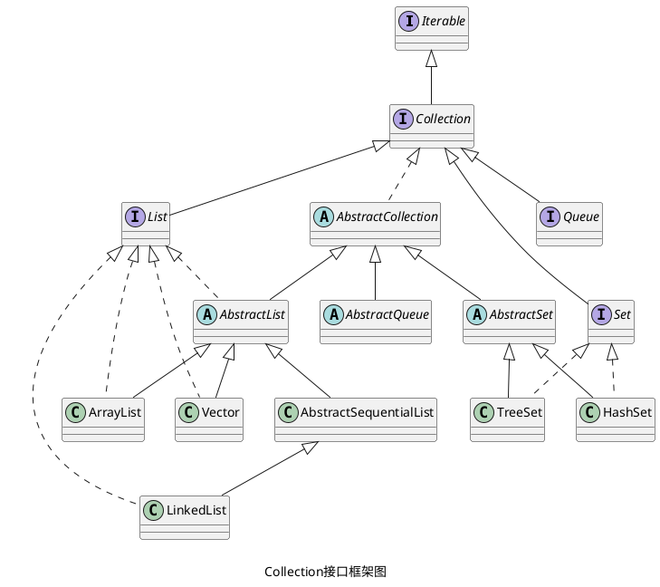

> [!summary]+ 
_为了减轻开发者的工作，Java 为开发者提供了 AbstractCollection 等抽象类，以 AbstractCollection 抽象类为例，抽象类实现了 Collection 接口中的大部分方法，开发者在继承 Collection 接口后，只需要继承 AbstractCollection 抽象类就可以不用重新实现 Collection 接口的大部分方法。_
