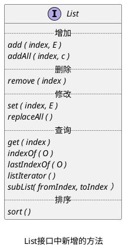
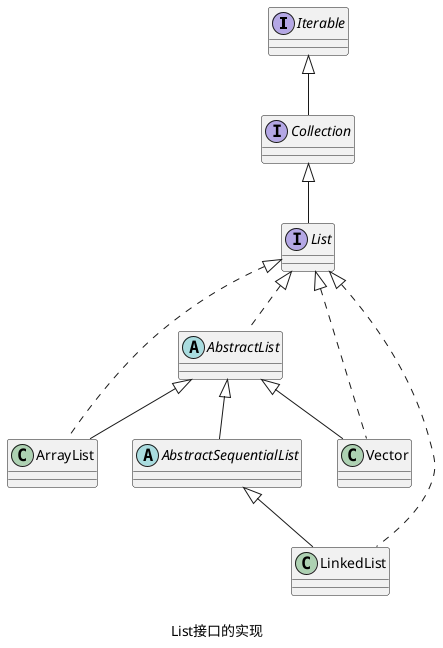

## List 接口相关操作

_List 接口继承自 Collection 接口，相比于 Collection 接口，List 接口增加了许多方法，这些方法基本上与 index 相关。_

^9ea51a

## List 接口的实现

> [!question] _**AbstractList 抽象类为什么要继承 AbstracCollection 抽象类？**_
>
> _AbstractList 抽象类应该实现 List 接口中的大部分方法，其中大部分方法已经在 AbstractCollection 抽象类中实现了，所以就可以通过继承 AbstractCollection 抽象类而不必实现这些方法。_
