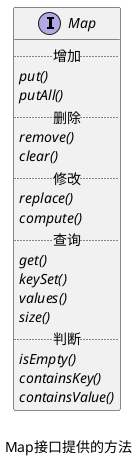
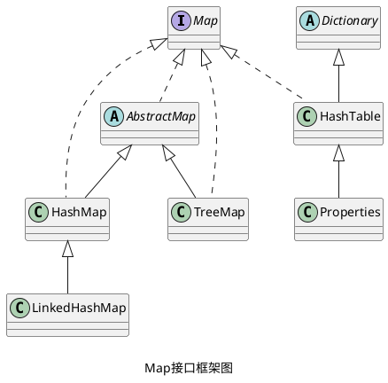

_Map 用于保存具有映射关系的数据，因此 Map 里保存着两组值，一组值用于保存 Map 里的 key，另一组值用于保存 Map 里的 value。_
![[Pasted image 20230320102359.png|分开看Map的key组和value组]]

## Map 接口相关操作

> [!tip]+ _compute() 是一个使用频率非常高的方法。_

## Map 接口的实现

> [!info] _HashMap 继承自 Abstract 抽象类。_

## question

> [!question]- _说说 HashMap 和 HashTable 的区别_
