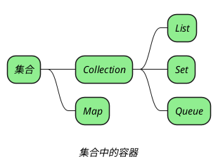
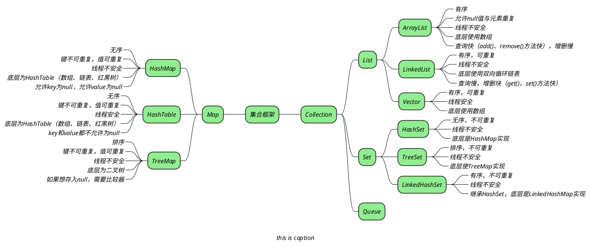

*Java 中的容器分为单例 Collection 和双列 Map 两大类，单列集合又可以分为列表 List、集合 Set 和队列 Queue。*

> [!note] _集合只能存放引用数据类型，不能存放基本数据类型。_
> _基本数据类型会自动装箱成引用数据类型。_

> [!note] _对一个容器最少要从下面四方面进行了解。_
> + _是否有序_
> + _是否允许 null 与元素重复_
> + _是否线程安全_
> + _底层数据结构_

> [!note] _集合中的有序和无序指是输出的顺序是否和插入的顺序保持一致。排序指的是插入后元素会进行自动排序。_

## question

> [!question]- _数组的缺点？_
> + _长度开始时必须指定，一旦指定不能更改。_
> + _保存的必须为同一类型的元素_
> + _使用数组进行增加和删除元素比较麻烦。_

> [!question]- _**java 中常见的容器有哪些？**_
>
> _java 中的容器定义在 java.util 包中，最顶层是两个基本的接口，Collection 和 Map。
> 也就是说，java 中的容器分为单列容器 Collection 和双列容器 Map 两大类。Collection 和 Map 接口下面有很多子接口类。常见的有列表（List）、集合（Set）、队列（Queue）。
> 总结一下就是，java 中常见的容器有 List、Set、Queue、Map 四种。_

> [!question]- _**集合和数组的区别是什么？，相比于数组，集合有哪些优势？**_
>
> _1、长度方面，数组创建之后其长度是固定的，一旦确定不能更改；集合的长度是可变的，可以保存任意多个对象。
> 2、存放的内容方面，数组既可以存储基本数据类型，也可以存储引用数据类型，但是同一个数组只能存储同一种数据类型；集合只能存储引用数据类型，但同一个集合可以存储不同的数据类型。
> 3、有时使用集合的原因是，集合内置了更加丰富的方法。_

> [!question]- _**List、Set、Map 和 Queue 之间的区别是什么？**_
>
> _List、Set、Map 和 Queue 之间的区别体现在两个方面：元素是否有序、是否允许元素重复。_

> [!question]- _**ArrayList 和 LinkedList 的区别是什么？**_
>
> _ArrayList 与 LinkedList 是同一种逻辑结构（线性表）在不同存储结构上的实现，_
> _ArrayList 的存储结构是顺序表，LinkedList 的存储结构为双向链表。_
> _ArrayList 和 LinkedList 之间的区别就是顺序存储和链式存储之间的区别，这里可以参考数据结构相关的内容。_
>
