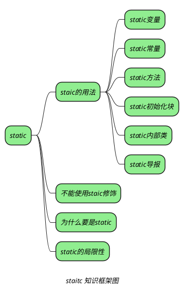

_static 的真正作用适用于区分成员变量、方法、内部类、代码块这四种成员到底是属于类还是属于实例。_
_如果将一个成员定义为 static，每个类只有一个这样的字段。而对于非静态的成员，每个对象都有自己的一个副本。_

## static 关键字的用法

+ _静态变量 -->[[静态常量]]_
+ _静态常量 -->[[静态常量]]_
+ _静态方法 -->[[静态方法]]_
+ _静态初始化块 -->[[静态初始化块]]_
+ _静态内部类 -->[[类和对象/常见关键字/static/静态内部类]]_
+ _静态导包 -->[[静态导包]]_

## 不能使用 static 修饰

1. *局部变量,局部变量是属于对象的*
2. *构造函数*
3. *方法的参数，与局部变量。*
4. *普通内部类中的方法和属性*

> [!note] *这里更新一下，JDK17 之后普通内部类中可以有静态方法和属性。*
> *普通内部类中要想使用静态属性必须使用 static final*
> *普通内部类中的方法不管是不是用 final，都不能使用 static 修饰。*

因为static final不能同时修饰方法。

普通内部类对象必须持有一个外部类的实例，才能访问到外部类的成员，如果内部类中有静态属性，也就是不需要依靠 

> [!note] *使用 static 修饰的意义在于，不使用对象就可以访问。*

> [!note] *构造函数的作用是初始化对象的，不是创建对象的，new 才是用来创建对象的，调用构造函数的时候，对象已经存在了。*

## static 成员的初始化

## 为什么要使用 static（优点）

1. 提高执行效率
   static 成员只会在程序加载时进行一次初始化，不需要每次创建对象时都进行初始化，一次可以减少内存的占用和程序的运行时间。
2. 可以在没有对象实例的情况下访问类的变量和方法。
   因为静态变量和方法是与类相关联的，而不是与对象相关联的，所以它们可以在没有对象实例的情况下访问。这样可以避免创建不必要的对象实例，从而提高程序的效率。
3. 可以方便地进行共享和传递数据。
   由于静态变量和方法是与类相关联的，它们可以被所有的对象实例共享和访问。这使得数据共享和传递变得更加方便。
4. 可以避免创建对象实例的开销。
   在一些情况下，创建对象实例的开销是很高的，因此使用静态变量和方法可以避免这种开销。比如，Java 中的 Math 类中的方法都是静态的，这样可以避免创建 Math 对象实例的开销。
5. 可以方便地进行类级别的操作。
   静态变量和方法是与类相关联的，而不是与对象相关联的，因此它们可以方便地进行类级别的操作，比如计算某个类的实例个数。

## static 的局限性（缺点）

1. *static 成员 只能访问 static 成员。*
2. *不能以任何形式引用 this、super。*
3. *static 变量在定义时必须要初始化。*
4. *不符合面向对象设计原则。*
5. *存在全局变量的风险。*
