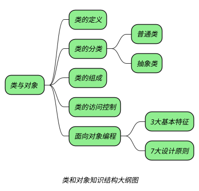

## 创建类

_类是具有相同特征和行为的对象的集合（类是一个模板，描述了一类对象的行为和状态），而对象是类的一个实例，每一个对象都有自己具体的行为和状态。_

_**在 Java 中使用 class 关键词定义一个类：**_

```java
[修饰符] class 类名{
	零个到多个构造器...
	零个到多个成员变量...
	零个到多个方法...
}
```

## 类的分类

+ _**除普通类外，Java 中还存在一种特殊的类：**_
	+ _抽象类 -->[[抽象类]]_

## 类的访问控制

+ _**下面关键词用于对类以及类中各个部分进行修饰：**_
	+ _public、protected、private-->[[访问属性]]_
	+ _static--->[[static]]_
	+ _final--->[[final]]_
	+ _transient_
	+ _synchronized、volatile_

## 面向对象编程

*Java 中创建对象的几种方式：*
1. *new*
2. *反射*

```java
Employee emp2 = (Employee) Class.forName("org.programming.mitra.exercises.Employee").newInstance();
//或者
Employee emp2 = Employee.class.newInstance();
```

3. *使用 Constructor 类的 newInstance 方法*
*也是反射，class.newInstance() 也是调用的 constructor.newInstance()*

```java
Constructor<Employee> constructor = Employee.class.getConstructor();
Employee emp3 = constructor.newInstance();

```

4. *使用 clone 方法,对对象进行拷贝*

```java
Employee emp4 = (Employee) emp3.clone();
```

4. *使用反序列化，将文件中的字节转换为对象*
*下面例子中将 data.obj 存储的字节转换为对象*

```java
ObjectInputStream in = new ObjectInputStream(new FileInputStream("data.obj"));
Employee emp5 = (Employee) in.readObject();
```

## question