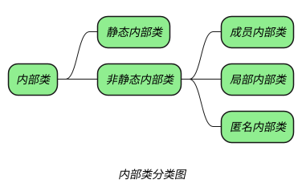

_定义在其他类内部的类称为内部类，包含内部类的类叫做外部类。_

## question

> [!question]- _什么是内部类？_
> _在 Java 中，可以将一个类的定义在另外一个类的内部，这就是内部类。_
> _内部类可以分为四种：成员内部类、局部内部类、匿名内部类和静态内部类。_

> [!question]- _内部类有什么优点？_
> 1. _内部类可以访问外部类的资源，包括私有数据。_
> 2. _内部类可以做到隐藏自己，具有更好的封装性。_
> 3. _内部类改善了 Java 中只能单继承的缺陷。_

> [!question]- _内部类有哪些应用场景？_

