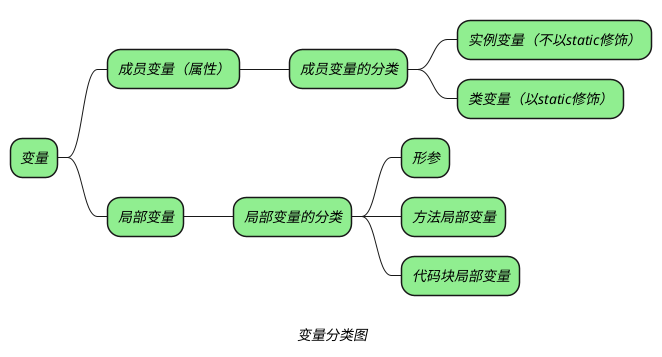

## 变量的声明

```java
int a;
int a,b,c;
```

_变量的命名要符合规则。_

## 变量的初始化

_成员变量可以隐式初始化_
_局部变量除了形参外都需要显式初始化_


*final 变量，可以在声明时初始化或者在构造函数或者静态代码块中初始化*
*static 变量，可以在声明时初始化或者自动初始化*
*static final，必须在声明时初始化*

*final 分为两种：*
+ *编译器常量：final int A = 10；*
+ *运行期常量：final int A = f();*

*编译器常量会在编译时初始化，也就是将代码中所有的 A 直接替换成 10。*
*static 成员在准备阶段分配内存，并且初始化*

*[JVM基础（三）一个对象的创建过程 - 知乎 (zhihu.com)](https://zhuanlan.zhihu.com/p/142614439)*

## 变量的使用

_变量的作用扩大会带来两大害处：_
+ _扩大变量的生存时间，导致更大的内存开销_
+ _扩大变量的作用域，不利于程序的内聚性_

_尽量缩小变量的作用范围_
+ _能用局部变量就不要用成员变量_
+ _能用代码块局部变量就不要用方法局部变量_
