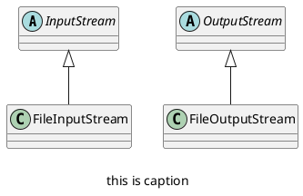
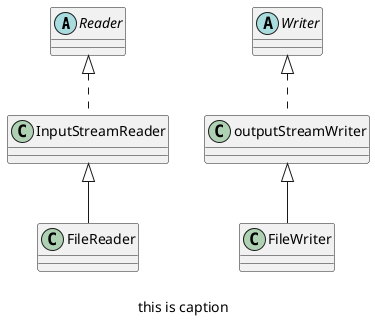

*文件流就是对文件进行读写的流，按照读写的单位又可以分为字节流（FileInputStream、FileOutputStream）和字符流（FileReader、FileWriter）。*
*字节流可以用来读写一切文件 ，字符流只能读写文本文件。*

## 文件字节流

```plantuml
@startuml
caption \n this is caption
abstract class InputStream
abstract class OutputStream
class FileInputStream
class FileOutputStream
InputStream <|-- FileInputStream
OutputStream <|-- FileOutputStream
@enduml
```

## 文件字符流

*文件自己流的底层利用的是转换流，二者是相同的。*

```plantuml
@startuml
caption \n this is caption
abstract class Reader
abstract class Writer
class FileReader
class FileWriter
class InputStreamReader
class outputStreamWriter
Reader <|.. InputStreamReader
InputStreamReader <|-- FileReader
Writer <|.. outputStreamWriter
outputStreamWriter <|-- FileWriter
@enduml
```