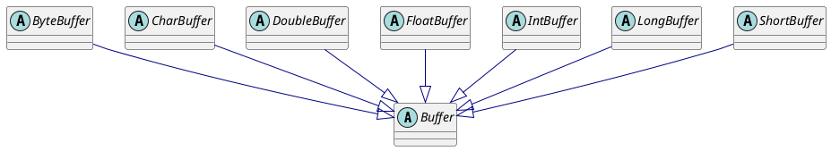

```plantuml
@startuml

abstract class Buffer
abstract class ByteBuffer
abstract class CharBuffer
abstract class DoubleBuffer
abstract class FloatBuffer
abstract class IntBuffer
abstract class LongBuffer
abstract class ShortBuffer

ByteBuffer    -[#000082,plain]-^  Buffer       
CharBuffer    -[#000082,plain]-^  Buffer       
DoubleBuffer  -[#000082,plain]-^  Buffer       
FloatBuffer   -[#000082,plain]-^  Buffer       
IntBuffer     -[#000082,plain]-^  Buffer       
LongBuffer    -[#000082,plain]-^  Buffer       
ShortBuffer   -[#000082,plain]-^  Buffer       
@enduml

```