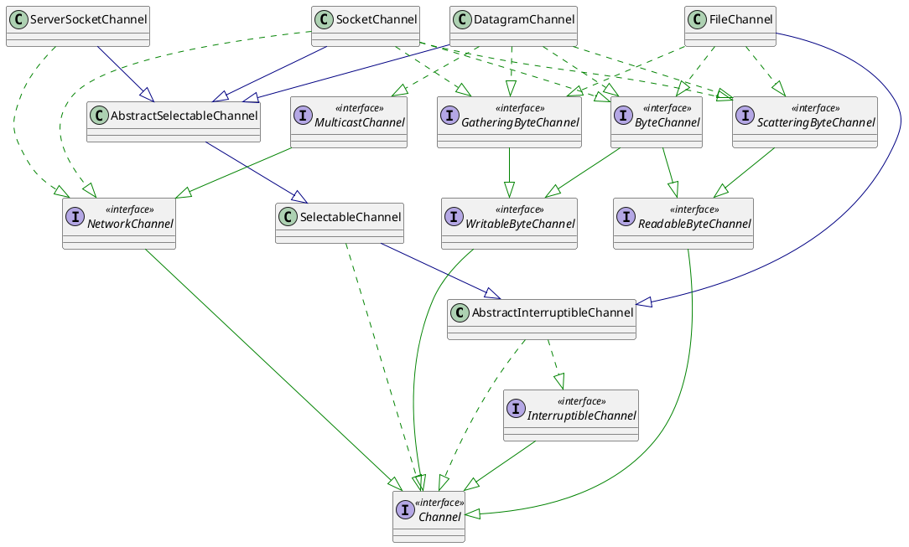

## Channel

```plantuml
interface Channel{
	{abstract} isOpen()
	{abstract} close()
}
```

*数据总是需要在两个数据源之间进行读写操作，这个动作由谁完成，放在具体的数据源中并不现实，没法做到代码复用。*
*在 Java 中，将这些动作拆分出来，由一个第三者完成，这个第三者叫做通道（Channel）或者流（Stream）。*

### Channel 的分类



*Java 中常用的 Channel 的 channel 有 4 中类型：*
+ *FileChannel*
+ *SocketChannel*
+ *ServerSocketChannel*
+ *DatagramChannel*

*Channel 只能与缓冲区交互，与 Stream 相同，Channel 也是有方向的：*
+ *从文件流向缓冲区：read*
+ *从缓冲区流向文件：write*

### 获取 Channel

*方法一：调用 getChannel() 方法，Java 中可以获取 Channel 的对象如下：*
+ *FileInputStream*
+ *FileOutputStream*
+ *RandomAccessFile*
+ *DatagramSocket*
+ *Socket*
+ *ServerSocket*

*方法二：通过 Files.newByteChannel() 获取字节通道*
*方法三：通过通道的静态方法 open() 打开并返回指定通道*

*对文件进行读写必须获取文件描述符。*
