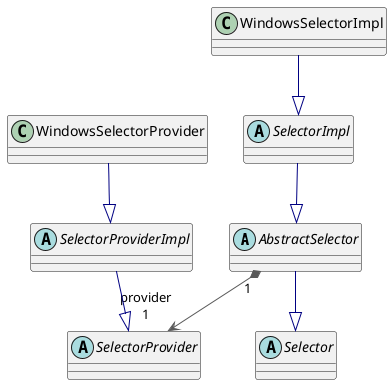

```plantuml
@startuml

abstract class AbstractSelector
abstract class Selector
abstract class SelectorImpl
abstract class SelectorProvider
abstract class SelectorProviderImpl
class WindowsSelectorImpl
class WindowsSelectorProvider

AbstractSelector         -[#000082,plain]-^  Selector                
AbstractSelector        "1" *-[#595959,plain]-> "provider\n1" SelectorProvider        
SelectorImpl             -[#000082,plain]-^  AbstractSelector        
SelectorProviderImpl     -[#000082,plain]-^  SelectorProvider        
WindowsSelectorImpl      -[#000082,plain]-^  SelectorImpl            
WindowsSelectorProvider  -[#000082,plain]-^  SelectorProviderImpl    
@enduml
```
