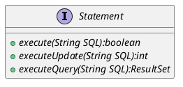

SQL---
aliases: 
tags: 
---
*在 JDBC 中通过 Statement 来执行 SQL 语句，Statement 有下面 3 种类型：*
![[Pasted image 20230613214914.png]]

## Statement

*Statement 种每一条语句种的参数都是写死的，所以每条语句都是不同的，都需要重新编译。*
*编译会在执行 SQL 语句的过程中占用大量时间。*
*同时 Statement 会发生 SQL 注入。*

*获取 Statement：Connection.createStatement()*
*关闭 Statement：Statement.close()*



## PreparedStatement

*PreparedStatement 对应数据库种的存储过程，相比于普通的 Statement，他是预编译的。*
*因为使用 PreparedStatement 后，几乎所有的 SQL 的结构是相同的，只需要传入参数即可。*

*同时 PreparedStatement 可以防止 SQL 注入。*

```java
PreparedStatement updateSales = con.prepareStatement("UPDATE COFFEES SET SALES = ? WHERE COF_NAME LIKE ? ");
updateSales.setInt(1, 75);
updateSales.setString(2, "Colombian");
updateSales.executeUpdate();
```

## CallableStatement

*CallableStatement 调用数据库中已经存在的存储过程。*

```java
String sQL = "{call getEmpName(？, ？)}";
cstmt = conn.prepareCall (SQL);
```

*PreparedStatement 会将执行的 sql 语句创建为存储过程，不过只能使用 IN 参数。*
*CallableStatement 对象可以使用所有三个。*

![[Pasted image 20230613221340.png]]