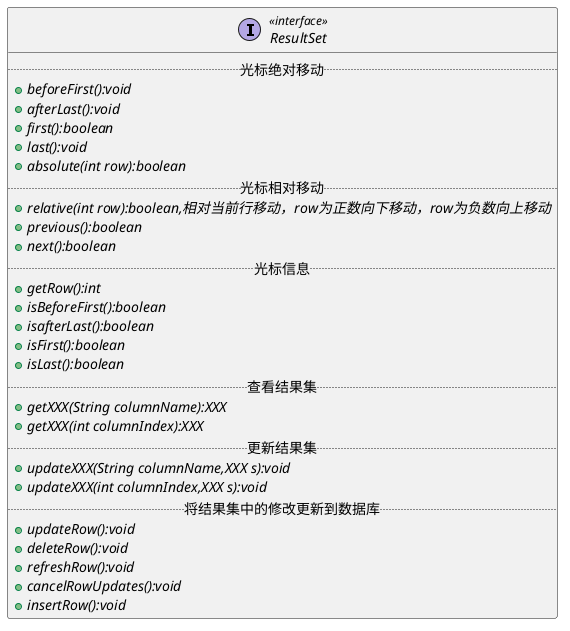

*结果集，ResultSet，通过执行查询语句生成。是由查询语句返回的结果。*

*对数据集必须按照行进行处理，ResultSet 维护着一个光标，光标指向第一行之前。*
*每调用一次 next()，光标指向下一行。返回 boolean，代表下移后所指向的行是否有记录。*

*ResultSet 中提供的基本方法如下：*

*结果集的特性：*
+ *可滚动性：
	如果结果集只能向前移动则称为可滚动，如果既可以向前移动又可以向后移动则称为可滚动*
+ *敏感性：*
	*数据库的 update 是否可以影响到结果集*
+ *可更新性:*
	*结果集是否可以更新*

*JDBC 中在创建 statement 时可以指定生成的结果集类型:*
+ *createStatement(int RSType,int RSConcurrency)*
+ *prepareStatement(String SQL,int RSType,int RSConcurrency)*
+ *prepareCall(String sql,int RSType,int RSConcurrency)*

*RSType(默认为 TYPE_FORWARD_ONLY):*
![[Pasted image 20230613214447.png]]
*RSConcurrency(默认为 CONCUR_READ_ONLY):*
![[Pasted image 20230613214514.png]]