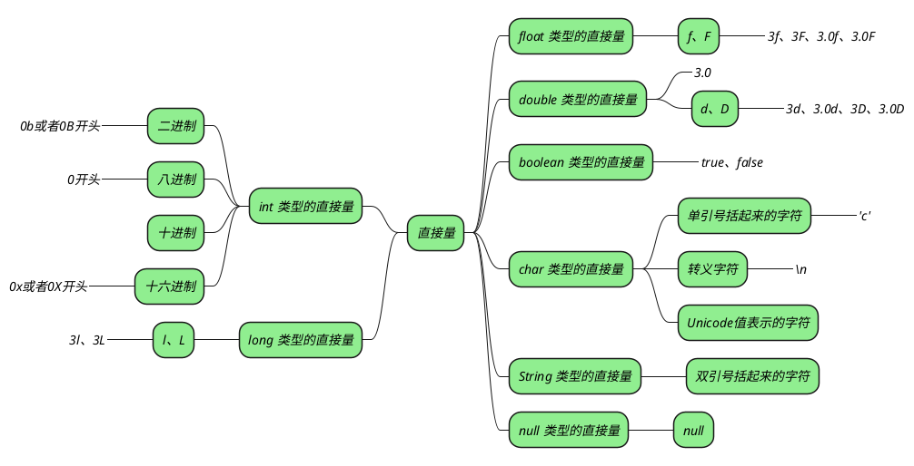

## 变量

### 变量的声明与初始化

_变量定义时，既可以指定初始值，也可以不指定初始值，但是定义变量至少需要指定**变量类型**和**变量名**两部分：_

```java
type varName [= 初始值];
```

_在编译阶段，编译器会在变量声明时，**通过数据类型为变量分配内存**，并使用**符号表**记录变量名和内存地址（首地址）的对应关系，在变量初始化时，编译器**将初始化的值填在相应的内存地址处**。(实际的内存分配和初始化发生在运行阶段，这里指的是分配和初始化的语句。）_

_多个同类型的变量可以同时定义或者初始化，中间使用逗号分割：_

```java
String username,address,phone,tel;    // 声明多个变量
int num1=12,num2=23,result=35;    // 声明并初始化多个变量
```

_位于类中的全局变量如果没有显示初始化，会被默认初始化_

_位于方法内的局部变量，必须显示初始化_

## 常量

_常量是一种不可变的量，其值在定义后不能被改变。_

### 常量的定义与初始化

_通过在变量前面添加 `final` 关键字来定义常量。（使用 `final` 定义常量只是它的作用之一）_

```java
final double PI = 3.14159;
final int R = 10;
```

> [!note]+ _在定义常量时，必须同时进行初始化。_
> _因为常量一定定义就不能更改。_

## 直接量

_直接量是指程序中出现的固定值，也被称作字面量。_

### 直接量的类型

_**Java 中支持下面 8 种类型的直接量：**_



> [!summary]+
_简单总结一下，java 中的数值类型中最简单写法有两种，3 和 3.0，前者默认为 int 类型，后者默认为 double 类型。_

### 使用直接量初始化变量或者常量

+ _对于数值类型，只要能发生自动类型转换都可以直接赋值 -->[[基本数据类型#^c3b246|直接量之间的自动类型转换]]_
+ _String、boolean 类型的直接量不能赋值给其他类型的变量_
+ _null 类型的直接量可以且只能赋值给引用类型的变量_

## 标识符

_标识符指的是用来命名变量、函数、类、接口、枚举等程序实体的名称。_

### 标识符的命名规则

+ _由字母、数字、下划线、美元符号 ($)、人民币符号 (¥)、可以表示字符的任何 Unicode 字符构成_
+ _不能以数字和表示字母的 Unicode 字符开头_
+ _区分大小写_
+ _不能为 java 关键字_

## question

> [!question]- _说说标识符的命名规则_
