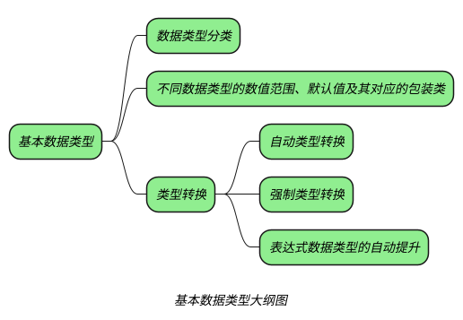
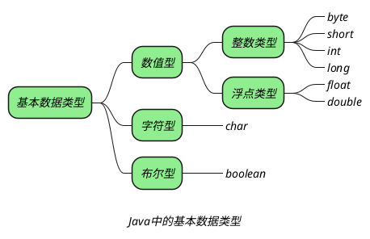
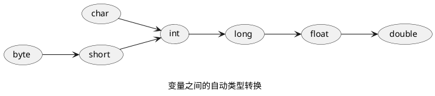
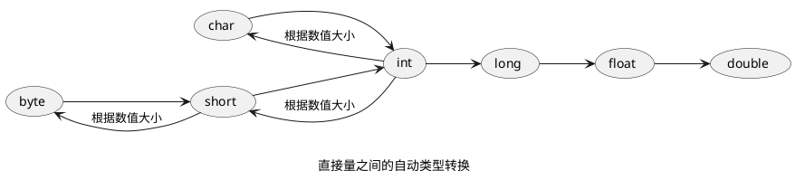

^204ad3

## 基本数据类型分类

_**Java 中有 8 种基本数据类型（4，2，1，1）：**_ ^227b77



### 浮点数

_**java 中的浮点数有两种表示形式：**_
+ _十进制数形式：5.12、512.0、.512_ ^f71e34
+ _科学计数法形式：5.12e2、5.12E2_

_**Java 还提供了三个特殊的浮点数值：**_
+ _正无穷大：POSITIVE_INFINITY_
	+ _使用一个正浮点数除以 0 将得到正无穷大_
+ _负无穷大：NEGATIVE_INFINITY_
	+ _使用负浮点数除以 0 将得到负无穷大_
+ _非数：NAN_
	+ _0.0 除以 0.0，或者对一个负数开方将得到非数_

> [!tip]+ _所有的正无穷大都相等，所有的负无穷大都相等。NaN 不与任何数值相等，甚至和 NaN 都不相等。只有参与运算的数中有浮点数参会的到上面三种类型的数，因为 java 会自动转换成浮点数，否则会抛出异常。_

### 数值中使用下划线分割

_Java 中的数值各位之间可以添加下划线，便于可读性：_
![[Untitled 4.png|200]]
![[Untitled 5.png|数值之间添加下划线|300]]

### 字符编码

> _java 中使用 Unicode 编码，Unicode 编码中前 256(’\u0000’~’\u00FF’) 个字符与 ASCII 码相同。_
> _**在 ASCII 或者 Unicode 中，一个字符的表现形式可以有以下几种:**_
> 1. _用 ASCII 编码或者 Unicode 编码表示_
>	_ASCII 编码：\0(八进制码值，\000-\377) Unicode 编码：\u0000(十六进制码值)_
> _2.单引号引用字符本身表示_
>	_‘a’_
> _3.使用对应整型表示，相当于 16 位的无符号整数 (0~65535)_
>	_0(十进制)_
> _4、转义字符_
>
> _无论如何表示，最终放入内存中的都是其二进制码值。一个 char 变量转型为 int 时，为其对应的 10 进制码值_

![[Untitled 3.png|char的默认值]]

### 布尔

_Java 中的 boolean 只能是 true 或者 false，不能用 0 或者非 0 来代表，也不能和其他类型的数据相互转换。_

## 不同数据类型的数值范围和默认值

_**不同的数据类型，会在内存在占用不同的字节，具有不同的表示范围：**_

```tx
[数值类型的默认值和取值范围]
|关键字  | 占用内存 (字节) |                    取值范围                    |  默认值  |
|:-------:|:--------------:|:----------------------------------------------:|:--------:|
|  byte   |       1        |         $-2^7\sim{2^7-1}$         |    0     |
|  short  |       2        |      $-2^{15}\sim2^{15}-1$      |    0     |
|   int   |       4        | $-2^{31}\sim2^{31}-1$ |    0     |
|  long   |       8        |             $-2^{63}\sim2^{63}-1$              |    0L    |
|  float  |       4        |                                                |   0.0f   |
| double  |       8        |                                                |   0.0d   |
|  char   |       2        |                                                | '\u0000' |
| boolean |       1        |                                                |  false   |
```

^8ef688

### 整数类型的取值范围

_计算机中使用补码的形式保存数据 -->[补码原理——负数为什么要用补码表示](https://cloud.tencent.com/developer/article/1471297?from=15425&areaSource=102001.1&traceId=UUNLlVGVgrOFcMhXE6P5l)_
_好处有两个：_
1. _变减操作为加操作_
2. _解决 -0 和 +0 的问题_

_在整型中，第 1 位为符号位，以 byte 举例，符号位占 1 位，后面 7 位可以表示 $2^7$ 个数。_
_在以 0 开头的正数中，0 占去一个数，所以正数最大值位 $2^7-1$。_
_在以 1 开头的负数中，因为没有 0，所以最小的负数为 $-2^7$。_
_所以 byte 类型的取值范围位 $[-2^7-2^7-1]$。_
_其他整型同理。_

### 浮点类型的取值范围

_在计算机中使用科学计数法保存浮点数，即：$a.b X 2^x$。Java 中使用的 IEEE745 标准。--->[Java浮点类型的精度与取值范围](https://blog.csdn.net/qq_39288456/article/details/104496479)。_
_在计算机中会存储三个部分：符号位、指数 (x)、尾数 (b)。a 不存储，默认为 1。_
![[Pasted image 20230424110103.png]]
_其中指数部分以 2 为底，在位移操作中，我们知道，乘 2^x 相当于小数点右移 x 位。_
_以上三部分都以二进制补码形式存储，并且指数部分包含符号为。8 位的指数取值范围为 $[-2^7-2^7-1]$。_
_所以对于符号位为 0 的正 float 来说，取值范围为 $[1.11111……(23)X2^{-128},1.11111……(23)X2^{127}]$。_
_所以对于符号位为 1 的负 float 来说，取值范围为 $[-1.11111……(23)X2^{127},-1.11111……(23)X2^{-128}]$。_
_其他浮点型同理。_

==_因为采用科学计数法表示，所以在存储浮点的时候要先转化成二进制的科学计数法表示，小数部分在转化为二进制的时候会造成精度丢失。_==

## 类型转换

### 自动类型转换

*只有数值类型之间可以进行自动转换。*

_基本数据类型中的 **数值类型** 之间支持自动类型转换，自动类型转换的规则如下图箭头所示。_



_上图是数值类型的**变量**之间的转换规则，而对于数值类型的**直接量**，可以参考下图：_



^c3b246
*由于直接量已经确定数值，确定的数值不超过范围就可以自从转换，而对于变量来说，要考虑最大值问题。*

> [!INFO]+ _对于**数值类型的变量**，图左边的类型可以自动转换成图右边的类型。对于**数值类型的直接量**，除了可以从左边转到右边外，对于整型的直接量可以从图右边的类型转换成图左边的类型。**可以跨箭头转**，并不一定 是相邻的才能自动转。_

### 强制类型转换

_如果要想不能自动类型转换的数据之间相互转换，只能进行强制类型转换。_

_在进行强制类型转换时，将一个范围大的数转换成一个超过其表示范围的变量时，java 将直接截断超过范围的一部分，从而会造成数据丢失，因此这种转换也称为“**缩小转换**”。_

_下图为将**int 类型的 233**转换成**byte 类型时变成 23**的示意图：_

![[Untitled 2.png|int类型与byte类型互转]]

_将 32 位的 int 类型的 233 强制转换成 8 位的 byte 类型时，需要截断前面的 24 位，只保留右边的 8 位。_

_剩下的 8 位中，最左边的 1 为符号位，表示这是一个负数，负数在计算中是以补码的形式存在的，因此还需要转换成源码。_

_最后的二进制原码为 10010111，byte 类型的值为 -(16+4+2+1)，即 -23。_

### 表达式中数据类型的自动提升

_当一个算数表达式中包含多个基本类型的值时，整个算术表达式的数据类型将发生自动提升。_

_自动提升规则如下：_
1. _如果表达式中，只有 byte 类型、short 类型、和 char 类型，结果将被提升到 int 类型。（不管结果中有没有 int 类型）。_
2. _如果表达式中共有比 int 等级更高的操作数，结果将被提升到与最高等级操作数相同的操作类型。_

> [!note] *也就是说表达式最后的类型会被提升到至少 int 级别。*

## question

> [!question]- _说说八种基本数据类型的大小，以及他们的封装类_
> _Java 中有 8 中基本数据类型，分别是：_
> 1. _byte：占用 1 个字节，封装类为 Byte。_
> 2. _short：占用 2 个字节，封装类为 Short。_
> 3. _int：占用 4 个字节，封装类为 Integer。_
> 4. _long：占用 8 个字节，封装类为 Long。_
> 5. _float：占用 4 个字节，封装类为 Float。_
> 6. _double：占用 8 个字节，封装类为 Double_
> 7. _char：占用 2 个字节，封装类为 Character。_
> 8. _boolean：占用 1 个字节，封装类为 Boolean。_
