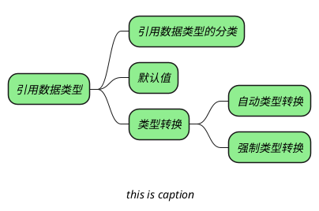
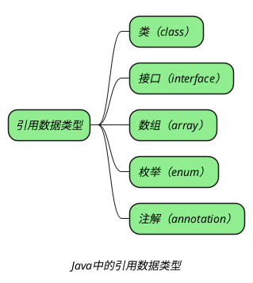

## 引用数据类型分类

_**Java 中有下面 5 种引用数据类型：**_

## 默认值

> [!tip]+ _引用数据类型的默认值都为 null_

## 类型转换

_引用数据类型的类型转换只能发生在有继承关系的类型中。上述 5 种数据类型，除数组外，都可以有继承关系。_
_根据两者之间在继承种的关系，可以分为：_
+ _向上转型：子类转为父类。_
+ _向下转型：父类转为子类。_

_向上转型可以进行自动类型转换，向下转型只能进行强制类型转换，并且向下转型前必须要进行向上转型。_

## question

> [!question]- _熟悉 Java 的对象引用类型吗？_
> + _强引用_
> + _软引用_
> + _弱引用_
> + _虚引用_
