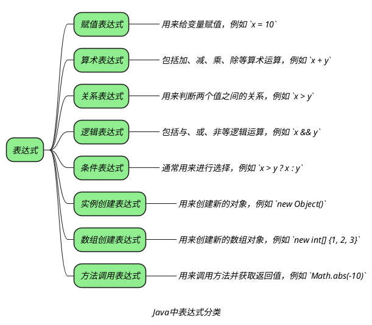

## 表达式分类

_表达式是由变量、常量、对象、方法调用和操作符组成的式子，表达式的计算结果必须是一个值。_
_简单来说，所有能求值的式子都选是表达式。_

```plantuml
@startmindmap
caption \n Java中表达式分类
skinparam NodeFontStyle italic
skinparam CaptionFontStyle italic
<style>
mindmapdiagram{
node {
	backgroundcolor lightgreen
}
}
</style>
+ 表达式
++ 赋值表达式
+++_ 用来给变量赋值，例如 `x = 10`
++ 算术表达式
+++_ 包括加、减、乘、除等算术运算，例如 `x + y`
++ 关系表达式
+++_ 用来判断两个值之间的关系，例如 `x > y`
++ 逻辑表达式
+++_ 包括与、或、非等逻辑运算，例如 `x && y`
++ 条件表达式
+++_ 通常用来进行选择，例如 `x > y ? x : y`
++ 实例创建表达式
+++_ 用来创建新的对象，例如 `new Object()`
++ 数组创建表达式
+++_ 用来创建新的数组对象，例如 `new int[] {1, 2, 3}`
++ 方法调用表达式
+++_ 用来调用方法并获取返回值，例如 `Math.abs(-10)`
@endmindmap
```

