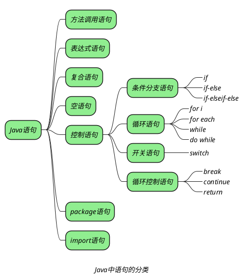

## 语句分类

*s1+=s2 在算出表达式结果后会进行自动类型转换 (强转)，然后赋值给 s1，s1=s1+s2 在算出表达式不能进行自动类型转换，必须手动强转*

```Java
short s1= 1; s1 = s1 + 1;
```

*上面语句错误，s1+1 为 int，s1 为 short，所以不会自动转换，必须手动强转*
*可以改为：*

```Java
short s1= 1; s1 += 1;
```

_**java 中常见的语句如下：**_



### if 条件语句

_**Java 中的 if 条件语句共有三种形式：**_
1. _if(){}_
2. _if()else{}_
3. _if()else if{}_

+ _对于 Java 来说，if 之后的括号里只能是一个==逻辑表达式==，即这个表达式的返回值只能是 true 或 false。因为 Java 中的其他类型不能转换成 boolean。_
+ _花括号 {} 括起来的多行代码被称为代码块，一个代码块通常被当作一个整体来执行（除非遇到 return，break，continue 等关键词或遇到异常），一次这个代码块也被称为==条件执行体==。_
+ _如果 {} 中只有一行代码则可以省略 {}。但是为了代码可读性，建议不要省略。_

_在写 if()else{} 或者 if()else if{} 时，else 的一个隐藏条件是对前面条件取反。_

```java
if(age>20){

}else if(age>40){

}else if(age>60){

}
```

_上面代码是一个错误实例，因为 else 的一个隐含的条件是对前面条件取反，因此上面代码也可以写成：_

```java
if(age>20){

if(age>40 && !(age>20)){

if(age>60 && !(age>40 && !(age>20))){

}
```

_可以看到后面两个条件永远是 false，永远也不会发生。_
_==因此为了避免错误，在写 if 语句时，一个规则就是将范围小的条件放在前面进行处理==。如下：_

```java
if(age>60)
{
}else if(age>40)
{
}else if(age>20)
{
}
```

### switch 语句

```java
switch (expression)
{
    case condition1:
    {
        statement(s);
        break;
    }
    case condition2:
    {
        statement(s);
        break;
    }
    ...
    default:
    {
        statement(s);
    }
}
```

_与 if 语句不同的是，switch 后面的括号中的表达式只能为 byte、short、char、int、枚举和 string 类型，不能为 boolean 类型。_
_在运行过程中，先对 expression 进行求值，然后匹配 condition1、condition2……等值，如果没有匹配的 condition，则执行 default 标签后的代码块。_

*在 switch 语句中，可以除了 long 之外的所有整型，和 string 以及 enum*

> [!note]
> _如果将 switch 语句的 break 去掉，会导致巨大错误。这是由于 siwtch 语句的运行机制导致的。_
> _switch 语句只会匹配一次，当匹配成功后，switch 会从相应的方法体开始执行，直到遇到 break 为止。_

> [!note]
> _Java7 中对 switch 语句进行了增强，控制表达式的值可以为 java.lang.String 类型，但是不能为 StringBuffer 或者 StringBuilder。_

### do while 循环

_与 while 循环不同的是，do while 循环会首先执行一次循环体，然后判断条件决定下次循环是否执行，因此 do while 循环至少会执行一次。_

### for 循环

_需要注意的是，for 循环的循环条件总是比循环体要多执行一次。_

### 使用 break 结束循环

_break 会结束其所在的循环，也就是说 break 默认指挥结束一层循环。_
_break 也可以结束多层循环，此时需要在 break 会面加一个标签：_

```java
public class BreakTest2{
	public static void main(String[] args){
		outer:
		for(int i=0;i<5;i++){
			for(int j=0;j<3;j++){
				if(i==1){
					break outer;
				}
			}
		}
	} 
}
```

_上面代码中的 break outer; 语句会结束 outer 标签指定的循环。_

> [!note]
> _Java 中的标签只有放在循环之前才有用。_

### 使用 continue 忽略本次循环剩下的语句

_与 break 不同的是，continue 指挥忽略本次循环中剩下的语句，然后继续执行下一次循环，并不会完全结束循环。_
_continue 后面也可以使用标签指定循环：_

```java
public class ContinueTest2 {
	public static void main (String[] args){ 
		outer:
		for(int i=0;i<5;i++) {
			for(int j=0;j<3;j++) {
				if(i==1) {
					continue outer;
				}
			}
		}
	} 
}
```

_上面代码在执行到 continue outer; 语句时需略的是 outer 标签指定的循环剩下的语句，也就是外层循环。而外层循环剩下的语句是 j=1 和 j=2 的情况，继续执行的是 i=1 的外层循环，而在执行的时候同样会忽略 j=1 和 j=2 的情况。_

### 使用 return 结束方法

_return 关键词放到方法中会直接结束这个方法。_
