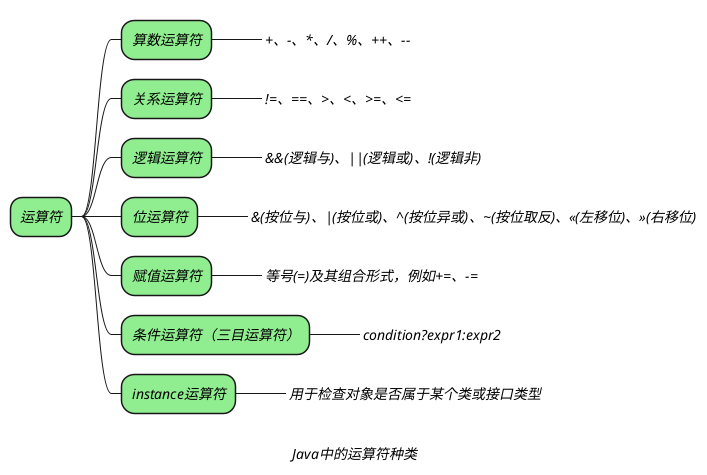

## 运算符分类



## 运算符的优先级

_运算符有不同的优先级，所谓的优先级就是再表达式运算中的运算顺序_
_下表中上一行的运算符优先级总是优先于下一行：_

```tx
[运算符优先级]
|     运算符说明     |                Java运算符                 |
|:------------------:|:-----------------------------------------:|
|       分隔符       |              . [] () {} , ;               |
|     单目运算符     |                ++ -- ~ ！                 |
| 强制类型转换运算符 |                 （type）                  |
|   乘法/除法/求余   |                   \* / %                   |
|     加法/减法      |                    \+ -                    |
|     移位运算符     |                 << >> >>>                 |
|     关系运算符     |          < <\= >\= > instanceof           |
|     等价运算符     |                 $==$ $!=$                 |
|       按位与       |                     &                     |
|      按位异或      |                     ^                     |
|       按位或       |                    \|                     |
|       条件与       |                    &&                     |
|       条件或       |                   \|\|                    |
|     三目运算符     |                    ?:                     |
|        赋值        | = += -= *= \\= \&\= \|\= \^\= \%= $<<=$ $>>=$ >>>\= |
```

> [!note]+ _赋值运算符是优先级最低的运算符。_

*按位与与按位或和按位异或是位运算符*
+ *按位与：同 1 为 1*
+ *按位或：有 1 为 1*
+ *按位异或：相异为 1*
*逻辑与与逻辑或是条件运算符*

## question

> [!question]- _熟悉 instance 关键字的作用吗？_
>
