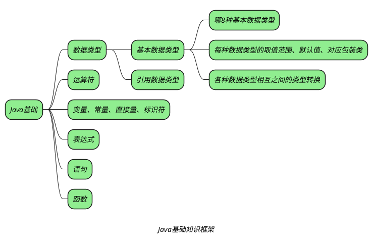
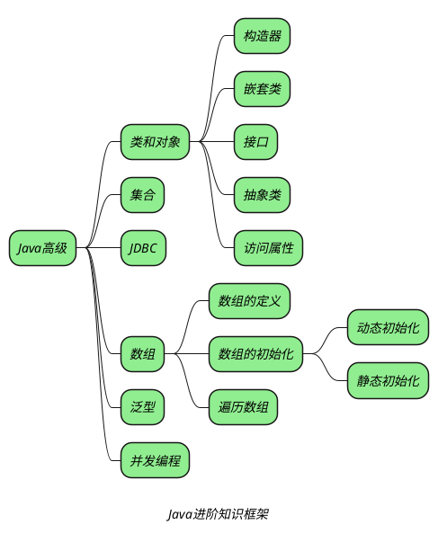

## Java 基础知识框架

```plantuml
@startmindmap
caption \nJava基础知识框架
skinparam NodeFontStyle italic
skinparam CaptionFontStyle italic
<style>
mindmapdiagram{
node {
    backgroundcolor lightgreen
}
}
</style>
+ Java基础
++ 数据类型
+++ 基本数据类型
++++ 哪8种基本数据类型
++++ 每种数据类型的取值范围、默认值、对应包装类
++++ 各种数据类型相互之间的类型转换
+++ 引用数据类型
++ 运算符
++ 变量、常量、直接量、标识符
++ 表达式
++ 语句
++ 函数
@endmindmap
```

## Java 高级知识框架

```plantuml
@startmindmap
caption \nJava进阶知识框架
skinparam NodeFontStyle italic
skinparam CaptionFontStyle italic
<style>
mindmapdiagram{
node {
    backgroundcolor lightgreen
}
}
</style>
+ Java高级
++ 类和对象
+++ 构造器
+++ 嵌套类
+++ 接口
+++ 抽象类
+++ 访问属性
++ 集合
++ JDBC
++ 数组
+++ 数组的定义
+++ 数组的初始化
++++ 动态初始化
++++ 静态初始化
+++ 遍历数组
++ 泛型
++ 并发编程
@endmindmap
```
