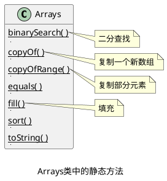
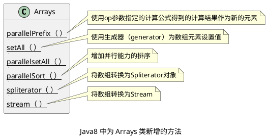

## Arrays 类中的静态方法



###   Java8 中为 Arrays 类新增的方法

_Java8 中为 Arrays 类新增了许多方法，这些方法可以利用 CPU 的并行能力来增强性能。_



### 方法使用实例

```java
public class Demo {  
    public static void main(String[] args) {  
        int[] arr1 = new int[]{3, -4, 25, 16, 30, 18};  
        Arrays.parallelSort(arr1); // 对数组进行排序  
        System.out.println(Arrays.toString(arr1)); // [-4, 3, 16, 18, 25, 30]  
  
        int[] arr2 = new int[]{3, -4, 25, 16, 30, 18};  
        Arrays.parallelPrefix(arr2, new IntBinaryOperator() {  
            @Override  
            public int applyAsInt(int left, int right) {  
//                left代表数组中前一个元素，计算第一个元素时，left为1  
//                right代表数组中当前索引处的元素  
                return left * right;  
            }  
        });  
        System.out.println(Arrays.toString(arr2)); // [3, -12, -300, -4800, -144000, -2592000]  
  
        int[] arr3 = new int[5];  
        Arrays.parallelSetAll(arr3, new IntUnaryOperator() {  
  
            @Override  
            public int applyAsInt(int operand) {  
//                operand代表正在计算的元素索引  
                return operand * 5;  
            }  
        });  
        System.out.println(Arrays.toString(arr3)); // [0, 5, 10, 15, 20]  
    }  
}
```
