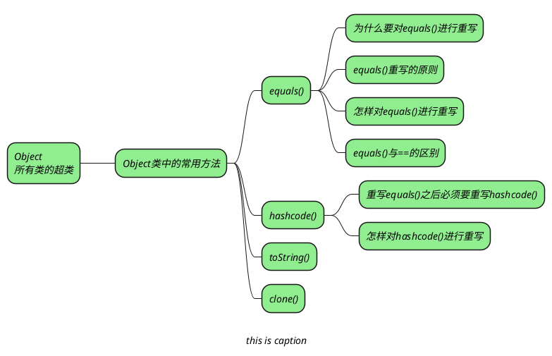
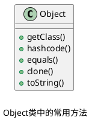

## Object 类中的常用方法



### equals() 方法

_Object 中的 equals() 方法默认通过=\=进行比较：_

```java
public boolean equals(Object obj) {  
    return (this == obj);  
}
```

#### 为什么要对 equals() 进行重写

_当我们创建一个类时，默认会继承 Object 类，如果不对 equals() 进行重写，则默认使用 Object 类中的 equals() 方法，Object 类中的 equals() 方法的底层是通过\=\=来实现的，也就是说只有在两个对象指向同一个内存地址是才会相同。_
_但大多数情况下，我们并不会进行这么严格的判断，例如，有两个 Person 对象，只要这两个 Person 对象中的 name 和 age 字段相同我们认为这两个对象相同。_

#### equals() 重写的原则

1. _自反性_

```java
x.equals(x);
```

2. _对称性_

```java
x.equals(y) == y.equals(x); //true
```

3. _传递性_

```java
if (x.equals(y) && y.equals(z))
	x.equals(z); //true
```

4. _一致性：多次调用 `equals()` 结果不变_

```java
x.equals(y) == x.equals(y); //true
```

5. _与 null 比较：对任何不是 null 的对象 x 调用 `x.equals(null)` 的结果都为 false_

```java
x.equals(null); //false
```

#### 如何对 equals() 进行重写

_**对 equals() 进行重写通常有下面基本步骤：**_
1. _通过\=\=检查是否是同一个对象的引用，如果是则返回 true。_
2. _检查通过参数传递进来的对象是否为 null，如果为 null 则返回 false。_
3. _如果 equals() 在子类中会改变，则调用 getClass() 比较两个对象是否属于同一个类。_
   _如果 equals() 在子类中不会改变，则使用 instanceof 来检测是否数据父子关系。_
   _如果是不属于同一个类或者不是父子关系则返回 false。_
4. _将两个对象转变成形同的类型。_
5. _判断我们需要判断的字段是否相等。_

```java
public boolean equals(Object obj) {  
    if (this == obj) return true;  
    if (obj == null) return false;  
    if (getClass() != obj.getClass()) return false;  
    Apple new_obj = (Apple) obj;  
    return name.equals(new_obj.name) // 引用类型用equals   
		&& price == new_obj.price; // 基本类型用==  
}
```

> [!note] _需要注意的是，在重写 equals() 方法的时候，参数的类型要为 Object，否则就不会覆盖 Object 类中的方法。_

#### equals() 与 == 比较

+ _对于基本数据类型
  \=\= 用于判断两个值是否相等，基本数据类型要想使用 equals() 方法进行比较则需要先转成其对应的包装类型。_
+ _对于引用数据类型，
  \=\= 判断两个变量是否引用同一个对象，即==是否指向同一内存空间==，
  而 `equals()` 是一个方法，其结果取决于具体的实现，比如在 Object 类中 equals() 的底层就是通过 \=\=来实现的，而在 Integer 类中，只判断了是否属于子类与父类，并且类包装的基本数据类型是否相等。
  通常来说，在我们的类中要对 equals() 方法进行重写，不一定非要指向同一内存地址，只需要类中的某些字段相同，我们就认为相同。_

```java
Integer x = new Integer(1);  
Integer y = new Integer(1);  
System.out.println(x.equals(y)); //true，内存中的值一致
System.out.println(x == y); //false，指向不同内存地址
```

### hashcode() 方法

_hashcode() 的作用是哈希码，一个 int 整数，哈希码中的作用是确定该对象在哈希表中的索引位置，hashcode() 卸载 Object 类中，因为每一个对象都有使用到哈希值进行存储的可能。_

> [!note]+ _重写 equals() 之后，必须要重写 hashcode()_
> _两个相等的对象散列值一定相等，但是散列值相等的两个对象不一定相等。重写 equals 之后，必须要重写 hashcode(),来维持这个规则_

> [!note] _IDEA 可以自动生成 equals() 和 hashcode()_

### toString() 方法

_**下面两种情况下会自动调用 toString()：**_
+ _将对象与字符串通过 `+` 连接_

```java
String s = "caption of Class P is "+ p;
```

+ _通过 System.out.println() 打印类_

```java
System.out.println(P);
```

_默认情况下，Object 类中的 toString() 方法返回 `类名+哈希值的无符号十六进制`。_

### clone() 方法

> [!note] _需要注意的是，clone 是一个 native 方法，是由 c++ 或 c 实现的，并不是一个空方法。_

#### 深拷贝

#### 浅拷贝

## question

> [!question]+ _一个空 Object 对象占多大空间？_
>

> [!question]- _Object 类中你知道的方法_
> _getclass()_
> _equals()_
> _hashcode()_
> _toString()_
> _clone()_

> [!question]- _说说 hashCode() 的作用？_
> _Java 中的集合有两类，一类是 List，还有一类是 Set。前者有序可重复，后者无序不可重复。当我们在 Set 中插入的时候怎么判断是否已经存在该元素呢，可以通过 equals 方法。但是如果元素太多，这种方法就会比较慢。_
> _于是有人发明了哈希算法来提高集合中查找元素的效率。这种方式将集合分成若干个存储区域，每个对象可以计算出一个哈希码，可以将哈希码分组，每组分别对应某个存储区域，根据一个对象的哈希码就可以确定该对象应该存储的那个区域。_
> _hashCode() 方法可以这样理解：他返回的就是根据对象的内存地址换算出的一个值。这样一来，当集合要添加新的元素时，先调用这个元素的 hashCode() 方法，就一下子能定位到他应该放置的物理位置上。如果这个位置上没有元素，他就可以直接存储在这个位置上，不用再进行任何比较；如果这个位置上已经有了元素，就调用他的 equals() 方法与新元素进行比较，相同的话就不存了，不同的话就散列到其他位置。这样一来实际调用 equals() 方法的次数就大大降低了，几乎只需要一两次。_

> [!question]- _为什么要有 hashcode?_
> _当你把对象加入 hashSet 的时候，hashSet 会先计算出对象的 hashCode 值来判断对象加入的位置，同时也会与其他已经加入的对象的 hashCode 值作比较，如果没有相同的 hashCode，hashSet 就会假设对象没有重复出现。_
> _如果发现有相同的 hashCode 值的对象，就会调用 equals() 方法来检查 hashCode 值相等的对象是否真的相同。_
> _如果两者真的相同，hashSet 就不会让其再加入。如果不同的话，就会重新散列到其他位置。_
> _这样就大大减少了 equals() 的访问次数，提高了执行效率。_

> [!question]- _说说你对 equals 和\=\=的理解_

> [!question]- _你重写过 hashcode() 和 equals() 吗，要注意什么？_
> + _equals() 方法重写时要注意满足 5 个原则：自反性、对称性、传递性、一致性、与 null 比较_
> + _如果两个对象通过 equals() 方法判定相等,那么他们 hashcode 必须相等，所以重写了 equals() 方法之后必须重写 hashcode() 方法_
> + _hashcode() 方法重写时不能包含 equals 方法中没有的字段，否则会导致相等的对象可能会有不同的哈希值。_

> [!question]- _可以在 hashcode() 中使用随机数字吗？_
> _不行，同一个对象不管调用多少次 hashcode(),生成的哈希值都必须是是相同的_

> [!question]- _有没有可能两个不相等的对象有相同的 hashcode 值_
> _有可能，两个不相等的对象可能有相同的 hashcode 值，这就是为什么会在 hashmap 中会有冲突。_

> [!question]- _两个相同的对象会有不同的的 hashcode 吗？_
> _不能，相等的对象 hashcode 值必须相等。_

> [!question]- _深拷贝和浅拷贝有什么区别？_

> [!question]- _Integer a= 127 与 Integer b = 127 相等吗？_
