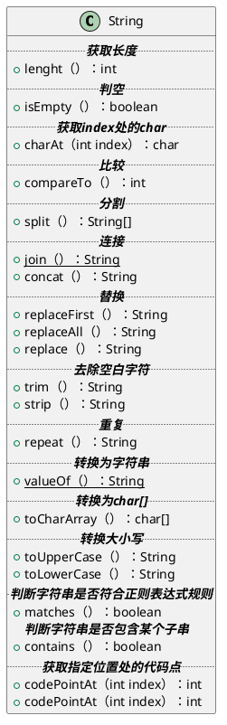

## question

> [!question]- _String 类的常用方法有哪些？_
> + _indexOf()：返回指定字符的索引。_
> + _charAt()：返回指定索引处的字符。_
> + _replace()：字符串替换。_
> + _trim()：去除字符串两端空白。_
> + _split()：分割字符串，返回一个分割后的字符串数组。_
> + _getBytes()：返回字符串的 byte 类型数组。_
> + _length()：返回字符串长度。_
> + _toLowerCase()：将字符串转成小写字母。_
> + _toUpperCase()：将字符串转成大写字符。_
> + _substring()：截取字符串。_
> + _equals()：字符串比较。_

> [!question]- _String 字符串为什么说是不可变？_
> _String 类中使用 final 关键字修饰字符数组来保存字符串，private final char value[]，所以 String 对象是不可变的。_
> _其实，这里很不严谨，final 修饰数组，数组中的任何元素是可以被替换的。重点是 value 数组不能被外界修改（没有提供 public 修饰的方法来修改 value 数组），所以，你是没发改变其内容的。_
