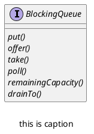

*阻塞队列不仅是一个线程安全的队列，而且是一个生产设消费者模型。*

*阻塞队列有下面两种：*
+ *有界队列：ArrayBlockingQueue*
+ *无界队列：LinkedBlockingQueue*

## BlockingQueue 接口

*ArrayBlockingQueue 的上层接口并不是 Queue 而是 BlockingQueue，BlockingQueue 在接口中新增了几个方法，在使用的时候应该尽量使用这些方法。*



| 方法名            | 描述                                                         |
| ----------------- | ------------------------------------------------------------ |
| put               | 向队尾添加元素，如果队满，阻塞线程，直到添加成功             |
| offer             | 向队尾添加元素，如果队满，阻塞线程，直到到达时间或者添加成功 |
| take              | 从队头取元素，如果队空，阻塞线程，直到取成功                 |
| poll              | 从队头取元素，如果队空，阻塞线程，直到到达时间或者取成功     |
| remainingCapacity | 获取队列剩余空间数量                                         |
| drainTo           | 将队列中元素转移到指定集合中                                 | 

## ArrayBlockingQueue

*ArrayBlockingQueue 是一种有界队列，内部通过顺序存储结构来实现队列。*
*因为是有界队列，所以初始化时必须指定队列大小。*

*ArrayBlockingQueue 提供了三个构造方法：*

```java
ArrayBlockingQueue(int capacity)
ArrayBlockingQueue(int capacity, boolean fair)  // 可重入锁是否公平
ArrayBlockingQueue(int capacity, boolean fair, Collection<? extends E> c) // 将集合添加到队列中
```

### put

```java
public void put(E e) throws InterruptedException {  
	checkNotNull(e);  
	final ReentrantLock lock = this.lock;  
	lock.lockInterruptibly();  
	try {  
		while (count == items.length)  
			notFull.await();  
		enqueue(e);  
	} finally {  
		lock.unlock();  
	}  
}
```

*可以看到 ArrayBlockingQueue 通过显式锁 ReentrantLock 来保证线程安全，添加元素的线程必须要先拿到所。*
*同时 ArrayBlockingQueue 使用两个显式条件 notFull 和 notEmpty 来实现生产设/消费者模型。*

```java
final ReentrantLock lock;
private final Condition notEmpty;
private final Condition notFull;
```

*具体的入队出队逻辑和非线程安全的队列是相同的，具体细节看一看 -->[深入理解Java系列 | BlockingQueue用法详解](https://juejin.cn/post/6999798721269465102)*