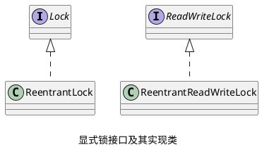

*显式锁是 Java 中提供的另外一种保证线程互斥的机制，与 synchronized 相比，显式锁更加灵活，并且功能更多。*

*Java 中显式锁接口和类位于包 java.util.concurrent.locks 下：*

```plantuml
@startuml
caption \n 显式锁接口及其实现类
interface Lock
interface ReadWriteLock
class ReentrantLock
class ReentrantReadWriteLock
Lock <|.. ReentrantLock
ReadWriteLock <|.. ReentrantReadWriteLock
@enduml
```
