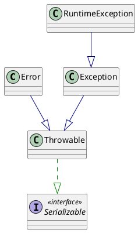

Java 中将可抛出异常分为两类：
+ *Error：错误，jvm 无法解决的问题*
+ *Exception：异常，jvm 可以和处理的问题*

*Exception 又可以分为运行时异常，可编译时异常，RuntimeException 及其子类都被称为运行时异常。*

*编译时异常在编译期可以检查出来，ide 会进行提示，不需使用 try 语句捕捉或者抛出，否则无法通过编译。*
*运行时异常在编译期无法检查，不进行处理也可以通过编译。*

