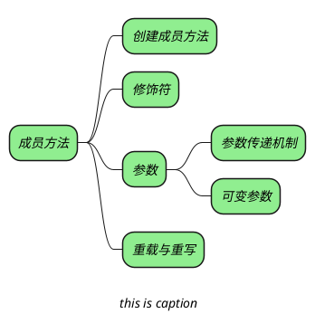

## 创建成员方法

```java
[修饰符] 方法返回值类型 方法名（形参列表）{
	// 由零条或多条可执行语句组成的方法体
}
```

## 方法的修饰符

+ _修饰符：修饰符==可以省略==，也可以是 public、private、protected、static、final、abastract，其中 ==public、private、protected== 三个最多只能出现其中一个；==abstract 和 final== 最多只能出现一个，他们可以和 ==static== 组合起来修饰方法。_


1. _public、private、protected 控制该方法的访问权限_
2. _abstract、final 控制方法体什么时候实现_
   + _abstract，必须在子类中实现，当前类中不能有方法体_
   + _final，必须在当前类中实现，子类中不能重写_
3. _static 控制该方法属于类还是对象_

## 方法的参数

_形参：定义方法时，在参数列表中声明的参数为形参。_
_实参：在调用方法时，传递给形参的参数为实参。_

### 参数传递机制

_与 C 不同的时，Java 中的参数传递方式只有一种：值传递。（对于引用类型同样是值传递）_

> [!note] _需要注意的是，引用类型的变量是指向对象的引用，它的复制品和它指向的是同一个对象。_

_所谓值传递，就是将实参的副本传入方法内。实参不会因为形参的改变而受到任何影响。_

### 可变参数

_在 Java 之中可以声明可变参数，也就是形参个数可以变化的参数。_

```java
public static void test(int a, String... books){} //声明
test(5,"参数1"，"参23"，"参数3"); //调用
```

_可变参数的本质就是一个数组参数，在调用过程中，系统会将多个实参当成数组进行传递。_
_上面的声明方式与下面的声明方式是相同的：_

```java
public static void test(int a, String[] books){}
```

_尽管二者的本质相同，但是还是有区别的：_
+ _可变参数更加简洁_
+ _可变参数必须为参数列表的最后一个参数，数组参数可以放在任意位置_
+ _一个方法中只能有一个可变参数，数组参数可以有多个_
+ _传递实参给数组参数时必须手动将实参封装为数组，可变参数可以自动封装_

## 重载和重写

### 重载

_在同一个类中包含两个或两个以上的方法名相同，形参列表不同的方法，叫做方法重载。_

_方法的重载可以总结为“==两同一不同==”：_
+ _同一个类_
+ _方法名相同_
+ _参数列表不同_

> [!note] _方法的重载与修饰符和返回值类型没有任何关系，可相同可不同。_

### 重写

^62bd53

_在子类中包含与父类同名方法的现象被称为方法重写，也称方法覆盖。_

_方法的的重写需要遵循“==两同两小一大==”的原则：_
+ _方法名相同_
+ _形参列表相同_
+ _子类方法的返回值类型要比父类方法的返回值类型更小或相等_
	*基本数据类型相等，大小体现在父子关系上*
+ _子类方法声明抛出的异常应该父类方法声明抛出的异常更小或相等_
+ _子类方法的访问权限应比父类方法的访问权限更大或相等_

> [!note] _子类中要想调用父类中被覆盖的方法可以通过 super 进行调用。_

> [!warning]+ _父类中的 private 方法是无法重写的，因为子类无法访问该方法。即使子类中定义了一个与该 private 方法具有相同的方法名、相同返回值类型、相同参数列表的方法，依然不是重写，只是在父类中定义了一个新方法。_

## question

> [!question]- _为什么 Java 中只有值传递？_

> [!question]+ _说说重载和重写的区别_
> 1. _重载发生在同一个类中，重写发生在子类和父类中_
> 2. _重载只涉及到方法名和形参列表，重写除了方法名和形参列表外还涉及到访问权限、返回值类型、异常声明_
