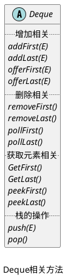

_Deque 是 Java 中对双端队列和栈的实现。_
_双端队列是一种特殊的队列，与普通队列相比：_
+ _普通队列在队尾添加元素，在队头删除或取元素_
+ _双端队列在对头和队尾都可以添加或删除元素_
![[Pasted image 20230315194728.png|双端队列操作示意图|300]]

> [!summary]+ _java 中同样为 Deque 提供了两种存储方式：_
> + _链式存储（LinkedList）--> [[集合/Collection/Queue/Deque/LinkedList|LinkedList]]_
> + _顺序存储（ArrayDeque）--> [[ArrayDeque]]_

## Deque 中的抽象方法

_Deque 接口继承自 Queue 接口，拥有 Queue 接口和 Collection 接口的所有方法。_
_Deque 接口为 Queue 接口中 3 组方法，都增加了在队头和队尾的相关操作。_

> [!tip]+ _除此之外，Java 为 Deque 增加了 pop()、push() 方法，也就是说，Deque 接口不仅是双端队列的实现，也是栈的实现。_

> [!warning]+ _Deque 是继承自 Queue 接口的，同时又提供了双端队列和栈操作的相关方法。也就是说 Deque 同时可以作为普通队列、双端队列、栈进行使用。具体是作为那种数据结构进行使用，我们需要使用相应的方法。_

*普通队列使用 offer()、poll()、peek（）*
*栈使用 push()、pop()*
*双端队列使用 xxxFirst()、xxxLast()*

*ArrayDeque 可以作为普通队列、双端队列、栈使用*
*LinkedList 可以作为线性表、普通队列、双端队列、栈使用*

*ArrayDeque 不支持 null*
*LinkedList 支持 null*