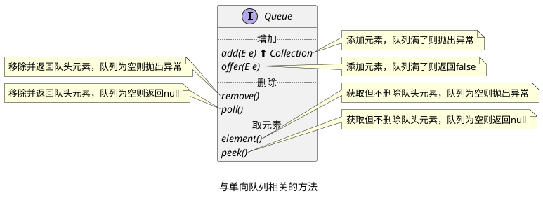
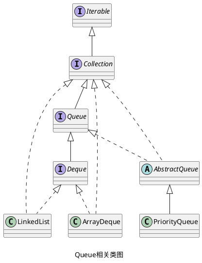

---
aliases:
tags:
---

## Queue 的定义

_Queue 是 Java 中对单向队列的实现，以先进先出的方法存储和访问元素，从后面添加元素，从前面删除。_

## 对 Queue 的操作

_作为一个单向队列，Queue 接口继承自 Collection 接口，拥有 Collection 接口中的所有方法。_
_除此之外，Queue 接口新增了 5 个方法，分别进行==添加==、==删除==和==获取元素==，与 add() 方法组成 3 组。这 3 组方法作为操作单向队列进行使用。_

## 接口的实现

_Java 中虽然提供了单向链表的接口，但是并没有直接提供单向链表的实现类，而是在单向链表的基础上进行增强，提供了下面两种形式的队列：_
+ _双端队列 (Deque)_
+ _优先队列 (PriorityQueue)_

