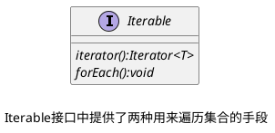

_Iterable 接口是专门用来遍历集合的，Iterable 接口中有两个方法，也就是遍历集合的两种手段_

```plantuml
@startuml
caption \n Iterable接口中提供了两种用来遍历集合的手段
interface Iterable{
{abstract} iterator():Iterator<T>
{abstract} forEach():void
}
@enduml
```
