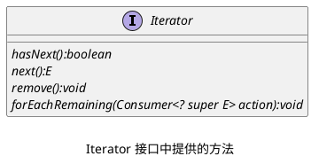

## Iterator 接口中的方法



### hasNext

_如果集合中有下一个元素，则返回 true，可以认为 Iterator 会维持一个游标，游标总会指向下一个要读取元素的上一个位置。_

### next

1. _将游标移动到下一个元素处_
2. _并返回下一个被读元素_

### remove

1. _删除游标指向的元素_

> [!note] _并不会改变游标指向，调用一次后，游标指向的指向的位置为空，如果再次调用会报错，所以 remove 方法必须和 next 方法配合使用。_

### forEachRemaining

_同 Iterator 接口中的 forEach() 方法一样，接收一个 Lambda 表达式来遍历集合。_

## 使用方法

```java
ArrayList<Object> objects = new ArrayList<>();  
objects.add(1);  
objects.add(2);
Iterator<Object> iterator = objects.iterator();  
while (iterator.hasNext()) {   // 是否存在下一个元素
    System.out.println(iterator.next());  // 移动游标到下一个位置，并读取该值
}
```

> [!note] _Iterator 中操作并不是集合中元素本身，传递给迭代变量的是集合中元素的值，所以对迭代变量的修改并不会影响集合中的元素。_

## 快速失败机制（fail-fast）

### 快速失败的原理

_在用迭代器遍历一个集合对象时，如果遍历过程中对集合对象的内容进行了增加、删除、修改操作，则会抛出 ConcurrentModificationException。_

_在分析 ArrayList 原理的时候，我们可以发现在 add 方法中维护了一个 modCount 变量。_
_每当对 ArrayList 中的结构进行修改时，都会改变 modCount 的值。_

> [!note] _ArrayList 的底层是一个数组，因此涉及到增加和删除元素的方法都会改变数组的结构，例如 add()、clear()、remove() 等方法。_

```java
public boolean add(E e) {  
    modCount++;  
    add(e, elementData, size);  
    return true;  
}
```

_快速失败机制，就是建立在 modCount 这个变量的基础上的。_
_在创建 Iterator 对象的时候，对象中会维护一个 expectedModCount 来记录下 modCount 的值_

```java
int expectedModCount = modCount;
```

_在使用 Iterator 对象中的方法进行操作时，会调用 checkForComodification（）方法来比较集合中的 modCount 和 Iterator 中 expectedModCount，如果发现不一致，则抛出异常。_

```java
final void checkForComodification() {  
    if (modCount != expectedModCount)  
        throw new ConcurrentModificationException();  
}
```

### 如果避免快速失败

> [!tip]+
> _在通过集合对象获取到 iterator 对象之后，和使用 iterator 对象中的方法（hasNext()、next()、remove() 等）之前，不能调用集合对象中，任何会改变集合结构的方法，如果要删除元素，请调用 iterator 对象中的 remove() 方法，而不是使用 collection 中的 remove() 方法._

_iterator 对象中的 remove() 方法同样会修改 modCount 变量，但是修改完之后会对 expectedModCount 变量进行更新，从而避免快速失败。_
